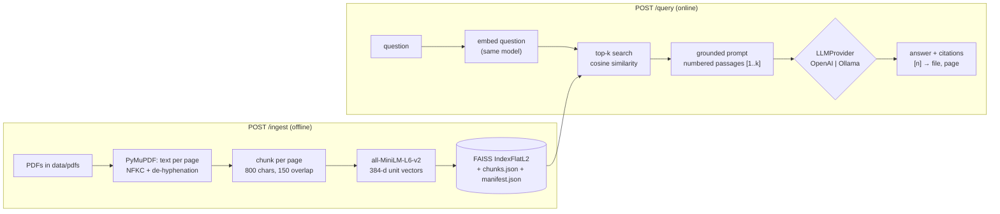

# rag-document-qa

A FastAPI service that answers questions about a set of PDFs **from the documents, not from
model knowledge**, and cites the file and page for every claim. Retrieval is written from
scratch (no LangChain): PyMuPDF extraction, overlapping chunking, local sentence-transformer
embeddings, a FAISS index, and a grounded prompt that refuses when the answer isn't in the context.

- **Local embeddings:** `all-MiniLM-L6-v2` (384-d) runs on CPU; no data leaves the machine until generation.
- **Swappable LLM:** OpenAI or a local Ollama model, chosen with one env var.
- **Measured:** a page-labeled eval set with recall@k and MRR, used to pick the chunk size.

## Architecture



| Module | Responsibility |
|---|---|
| [`app/config.py`](app/config.py) | Typed settings from `.env` (pydantic-settings); invalid values fail at startup |
| [`app/ingest.py`](app/ingest.py) | PDF → cleaned page text → overlapping chunks with `(source, page, chunk_index)` |
| [`app/store.py`](app/store.py) | FAISS index + chunk metadata kept in lockstep; save/load with consistency checks |
| [`app/retrieve.py`](app/retrieve.py) | `Embedder` (loaded once), `build_store`, `search` |
| [`app/generate.py`](app/generate.py) | Grounded prompt, `LLMProvider` protocol, OpenAI/Ollama providers, citation mapping |
| [`app/api.py`](app/api.py) | FastAPI app: lifespan loading, endpoints, error mapping, latency/token logging |
| [`eval/run_eval.py`](eval/run_eval.py) | recall@k / MRR over [`eval/questions.jsonl`](eval/questions.jsonl), chunk-size comparison |

## Results

Evaluated on the RAG paper itself ([Lewis et al., 2020](https://arxiv.org/abs/2005.11401), 19 pages)
with 33 answerable questions labeled with the page(s) that contain the answer, plus 3
unanswerable questions for refusal checks. Retrieval is exact (flat index), so runs are deterministic.

| chunk size / overlap | chunks | recall@1 | recall@3 | recall@5 | recall@10 | MRR@10 |
|---|---|---|---|---|---|---|
| 400 / 75 | 254 | 0.55 | 0.76 | 0.78 | 0.83 | 0.76 |
| **800 / 150 (default)** | 121 | 0.52 | 0.77 | 0.81 | **0.92** | 0.74 |
| 1200 / 225 | 79 | 0.50 | 0.72 | **0.84** | 0.87 | 0.73 |

- Smaller chunks rank the answer first slightly more often; 800 finds a relevant page in the
  top 10 for 30 of 33 questions. With 33 questions one question is worth 0.03, so most gaps are
  within noise: 800 is a reasonable middle, not a proven optimum.
- **Failure modes seen in the misses:** bibliography pages outranking prose ("What future work do
  the authors propose?" retrieved reference-list pages), and flattened results tables whose
  acronyms and digits overlap acronym-heavy questions ("DPR", "FEVER").

| Latency (CPU laptop) | |
|---|---|
| Embedding model load (once, at startup) | ~5.7 s |
| Retrieval per query (embed + search 121 vectors) | ~20 ms |
| Ingest 19-page PDF (121 chunks) | ~3.1 s |

Reproduce with `python -m eval.run_eval --configs 400:75 800:150 1200:225`. Add `--with-llm` to
also answer every question with the configured LLM and report answer rate, whether citations hit a
labeled page, and the refusal rate on unanswerable questions.

## Quickstart

Requires Python 3.12. Commands are for Windows PowerShell; on macOS/Linux use
`source .venv/bin/activate` and `cp` instead of `copy`.

```powershell
git clone https://github.com/hazeyxd23/rag-document-qa.git
cd rag-document-qa
python -m venv .venv
.venv\Scripts\activate
pip install -r requirements.txt

copy .env.example .env        # then set OPENAI_API_KEY, or LLM_PROVIDER=ollama

# PDFs are not committed; download the paper used for the eval set
curl.exe -L -o data/pdfs/rag_lewis_2020.pdf https://arxiv.org/pdf/2005.11401

uvicorn app.api:app --port 8001 --no-access-log
```

Then, in another terminal (or at http://localhost:8001/docs):

```powershell
Invoke-RestMethod -Method Post http://localhost:8001/ingest
Invoke-RestMethod -Method Post http://localhost:8001/query -ContentType application/json -Body '{"question": "Which retriever does RAG use?"}'
```

On macOS/Linux: `curl -X POST localhost:8001/query -H "Content-Type: application/json" -d '{"question": "Which retriever does RAG use?"}'`.

To use a local model instead of OpenAI: install [Ollama](https://ollama.com), run
`ollama pull llama3.2`, and set `LLM_PROVIDER=ollama` in `.env`.

Command-line tools (no server needed):

```powershell
python -m app.ingest data/pdfs            # inspect how PDFs get chunked
python -m app.retrieve build              # build and save the index
python -m app.retrieve search "question"  # show top-k chunks with scores
python -m app.generate "question"         # full RAG answer with citations
pytest                                    # unit + API tests (no API key needed)
```

## API

| Endpoint | Purpose | Errors |
|---|---|---|
| `GET /health` | Liveness plus whether an index is loaded and its size | — |
| `POST /ingest` | Rebuild the index from every PDF in `data/pdfs/`, save it, swap it in | 400 no readable PDFs, 409 ingest already running |
| `POST /query` | `{"question": str, "top_k": 1-20 (optional)}` → grounded answer | 422 invalid input, 503 no index yet, 502 LLM provider failed |

A `/query` response contains the answer, `answered` (false when the model refused),
`citations` (only the chunks the answer cites, each with `source`, `page`, `chunk_index`, `score`
and `text`), `retrieved` (everything that was in the prompt), `timings`
(`retrieval_ms`, `generation_ms`, `total_ms`) and `usage` (model and prompt/completion tokens).
Every request is logged with method, path, status and latency, and returns an
`X-Response-Time-ms` header. Queries also log retrieval/generation time and token counts, but not the
question text, since it may contain personal data.

## Design decisions

**No framework.** LangChain/LlamaIndex would hide the parts worth understanding: how text is
split, how vectors map back to text, and what the prompt actually says.

**Chunking: 800 characters, 150 overlap, never crossing pages.**
- *Why chunk at all:* one vector per page averages many topics together; the embedder also
  truncates input past 256 tokens, so text beyond that limit can never be found.
- *Why these sizes:* measured at ~3.9 characters per token on this corpus, 800 characters ≈ 200
  tokens, under the limit. Only 2 of 121 chunks exceed it, and both are numeric tables, which
  tokenize at ~2.3 characters per token. The build step logs a warning when this happens.
- *Boundaries and overlap:* chunks end at the last sentence boundary in the back half of the
  window. The 150-character overlap means a fact on a boundary appears whole in at least one chunk.
- *Per page:* every chunk has exactly one page, so citations are exact. The trade-off is that a
  sentence spanning a page break is split.

**The FAISS index and the metadata must stay in sync.** FAISS stores only vectors and returns
their positions. `chunks[i]` is the text and citation for vector `i`, so the index is only correct
if both were built together, in the same order.
- `VectorStore.add` takes vectors and chunks together.
- `manifest.json` records the embedding model and the chunk count, and is written last.
- `load()` refuses mismatched counts, and refuses an index built with a different embedding model:
  vectors from two different models aren't comparable, and mixing them fails silently, with
  confident wrong citations.
- Ingest always rebuilds from scratch, then swaps the new store in with one assignment, so
  in-flight queries never see a half-built index.

**Models load once at startup.** Loading the embedder takes ~5.7 s; a query embedding takes
~20 ms. FastAPI's lifespan hook loads the embedder, the LLM client and the index once and keeps
them on `app.state`. Bad LLM configuration (e.g. a missing API key) fails at startup instead of
on the first user's request. A missing index doesn't block startup: `/query` returns 503 until `/ingest`.

**Exact search, cosine scores.** Embeddings are L2-normalized, so squared L2 distance equals
`2 − 2·cos` and `IndexFlatL2` ranks exactly like cosine similarity. Scores are reported as
`1 − d/2`. Brute force over a few thousand vectors takes microseconds; IVF/HNSW only pay off
around a million vectors.

**Grounded prompt with a detectable refusal.** The system prompt allows only the numbered
passages, forbids prior knowledge, and requires the exact sentence
*"I don't know based on the provided documents."* when the answer is missing, so code can set
`answered: false`. The model cites passage numbers (`[2]`); code maps them back to file and page
and drops numbers that don't exist, so the model can't invent a filename. The passages are
declared to be data, not instructions, because PDF text is untrusted input.

**Provider-agnostic generation.** `LLMProvider` is a `typing.Protocol` with one method,
`generate(system, user) -> Generation(text, model, prompt_tokens, completion_tokens)`. OpenAI uses
the official SDK; Ollama is called over plain HTTP (`/api/chat`) with `httpx`. Both normalize
token usage and wrap their failures in one `GenerationError`, which the API maps to 502 with a
generic message; details stay in the server log.

**Sync endpoints on purpose.** `/ingest` and `/query` are `def`, not `async def`: embedding is
CPU-bound and the OpenAI SDK call is blocking, so FastAPI runs them in its thread pool and the
event loop stays responsive. `/ingest` holds a lock so two rebuilds can't write the same files.

**Page-level eval labels.** Chunk ids change whenever chunking changes; page labels don't, so one
labeled set compares any chunking configuration fairly. A page counts as relevant if a reader could
answer from that page alone. Labels were checked by matching key phrases against the extracted
page text before running retrieval.

## Limitations and next steps

- **Retrieval quality:** add BM25 alongside dense search (hybrid) for acronyms and exact terms, a
  cross-encoder re-ranker for top-k precision, and skip bibliography sections at ingest.
- **Irrelevant questions still retrieve k chunks.** The prompt handles refusals; a similarity
  threshold (off-topic questions scored 0.13–0.15 against 0.45–0.61 for real ones) could skip the
  LLM call entirely.
- **Extraction:** tables are flattened to text, scanned PDFs are skipped (no OCR), and real
  compound words split at a line end get joined ("knowledge-intensive" → "knowledgeintensive").
- **API:** ingestion reads a server folder; a file-upload endpoint, authentication, streaming
  responses and incremental indexing are natural extensions.
- **Eval:** 33 questions over one paper is enough to catch regressions, not to separate close configs.

## Project structure

```
rag-document-qa/
├── app/          config, ingest, store, retrieve, generate, api
├── data/
│   ├── pdfs/     source PDFs (gitignored; see Quickstart)
│   └── index/    built FAISS index + metadata (gitignored)
├── eval/         questions.jsonl, run_eval.py
├── tests/        pytest suite (fakes for the model and LLM; no API key needed)
├── .env.example
└── requirements.txt
```
